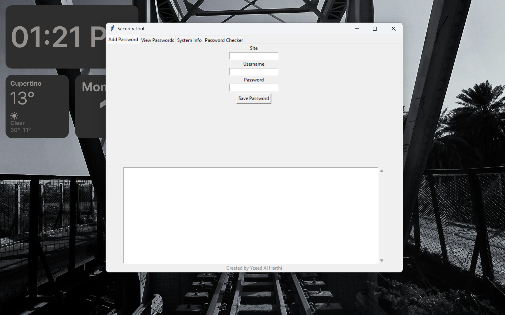

# 🔐 Security Tool

---

## ⚙️ Features

- Store encrypted passwords (site, username, password)
- View saved passwords using a master password
- Password strength checker
- Save system information (hostname, IP, OS)
- Local encrypted database (SQLite)

---

## 🖥️ Requirements

- Windows only
- Python (if running source code)
- OR pre-built executable (recommended)

---

## 🚀 How to Run (Executable Version)

1. Download or clone the project
2. Open the project folder
3. Go to: dist
4. Run : securitytool

⚙️ Configuration (Important)
• Default Master Password: 1234
• To change it: Open main.py and modify the password variable.

---

## ⚠️ Important Notes

- This tool stores data locally only
- No data is uploaded anywhere
- Each user has their own encrypted database
- Do NOT delete security.db while using the app (it will be recreated if missing)

---

## 👨‍💻 Creator

Created by Yzeed Al Harthi

---

## 📌 Disclaimer

This project is for educational purposes only.
